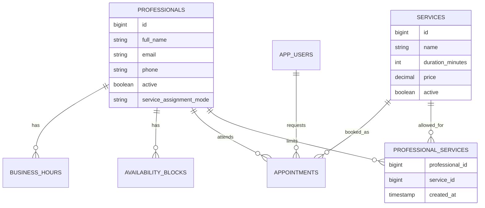
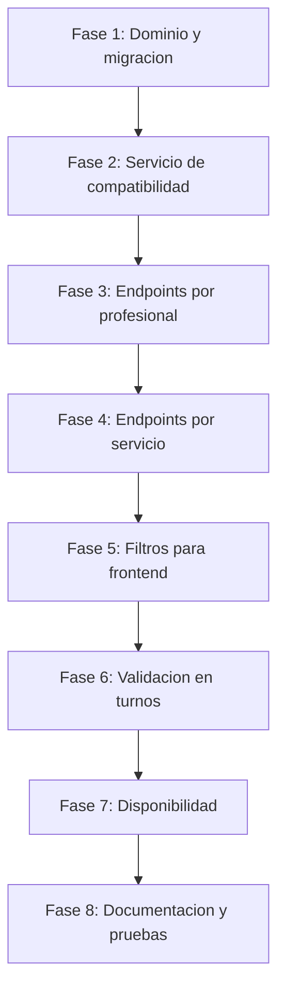

# Update 1.1 backend - Relacion profesional-servicio

Este documento define el plan de actualizacion para agregar la relacion entre profesionales y servicios sin romper los CRUD actuales ni bloquear el flujo simple de negocios chicos.

La idea de producto es un modelo hibrido:

- Por defecto, un profesional atiende todos los servicios.
- Opcionalmente, el admin puede limitar un profesional a servicios especificos.
- La asignacion puede gestionarse desde la pantalla de profesionales o desde la pantalla de servicios.
- La creacion de turnos y la disponibilidad deben respetar esa relacion.

## 1. Objetivo

Agregar soporte backend para saber que servicios atiende cada profesional y usar esa regla en:

- Catalogos administrativos.
- Consulta de disponibilidad.
- Creacion de turnos.
- Futuro flujo cliente.

El cambio debe mantener funcionando el caso simple:

```text
Si el admin no configura nada, todos los profesionales pueden atender todos los servicios.
```

## 2. Decision de diseno

La fuente de verdad sera el profesional.

Cada profesional tendra un modo de asignacion:

```text
ALL_SERVICES
SELECTED_SERVICES
```

Regla de habilitacion:

```text
Un profesional puede atender un servicio si:

professional.serviceAssignmentMode = ALL_SERVICES

o

professional.serviceAssignmentMode = SELECTED_SERVICES
y existe una relacion professional_services(professional_id, service_id)
```

Esto evita que el admin tenga que asignar servicios manualmente cuando el negocio es chico o cuando todos atienden todo.

## 3. Modelo de datos

### 3.1 Cambios en professionals

Agregar columna:

```text
service_assignment_mode VARCHAR(30) NOT NULL DEFAULT 'ALL_SERVICES'
```

Valores permitidos:

```text
ALL_SERVICES
SELECTED_SERVICES
```

### 3.2 Nueva tabla professional_services

```text
professional_services
- professional_id BIGINT NOT NULL
- service_id BIGINT NOT NULL
- created_at TIMESTAMP NOT NULL
```

Constraints:

```text
PRIMARY KEY (professional_id, service_id)
FOREIGN KEY professional_id -> professionals(id)
FOREIGN KEY service_id -> services(id)
```

Indices sugeridos:

```text
idx_professional_services_professional_id
idx_professional_services_service_id
```

### 3.3 Diagrama de relacion



## 4. Contratos de API

Los CRUD actuales se mantienen:

```http
POST /api/professionals
GET /api/professionals
GET /api/professionals/{id}
PUT /api/professionals/{id}
PATCH /api/professionals/{id}/activate
PATCH /api/professionals/{id}/deactivate

POST /api/services
GET /api/services
GET /api/services/{id}
PUT /api/services/{id}
PATCH /api/services/{id}/activate
PATCH /api/services/{id}/deactivate
```

La asignacion se maneja con endpoints nuevos para no mezclar alta/edicion basica con configuracion avanzada.

### 4.1 Asignar servicios a un profesional

```http
PUT /api/professionals/{id}/services
```

Request:

```json
{
  "mode": "SELECTED_SERVICES",
  "serviceIds": [1, 2, 5]
}
```

Para volver al modo simple:

```json
{
  "mode": "ALL_SERVICES",
  "serviceIds": []
}
```

Response sugerida:

```json
{
  "professionalId": 1,
  "mode": "SELECTED_SERVICES",
  "services": [
    {
      "id": 1,
      "name": "Limpieza facial",
      "active": true
    }
  ]
}
```

### 4.2 Consultar servicios asignados a un profesional

```http
GET /api/professionals/{id}/services
```

Response:

```json
{
  "professionalId": 1,
  "mode": "ALL_SERVICES",
  "services": []
}
```

Nota:

- Si `mode = ALL_SERVICES`, `services` puede venir vacio porque no hace falta guardar todos los servicios.
- El frontend puede mostrar "Todos los servicios".

### 4.3 Asignar profesionales a un servicio

```http
PUT /api/services/{id}/professionals
```

Request:

```json
{
  "mode": "SELECTED_PROFESSIONALS",
  "professionalIds": [1, 3]
}
```

Para dejar el servicio disponible para todos los profesionales compatibles:

```json
{
  "mode": "ALL_PROFESSIONALS",
  "professionalIds": []
}
```

Importante:

- Internamente la fuente de verdad sigue siendo el profesional.
- Este endpoint funciona como un atajo administrativo desde la pantalla de servicios.
- Si se usa `SELECTED_PROFESSIONALS`, el backend debe actualizar las asignaciones de los profesionales afectados de forma consistente.

### 4.4 Consultar profesionales que atienden un servicio

```http
GET /api/services/{id}/professionals
```

Response:

```json
{
  "serviceId": 1,
  "mode": "ALL_PROFESSIONALS",
  "professionals": [
    {
      "id": 1,
      "fullName": "Ana Gomez",
      "active": true,
      "serviceAssignmentMode": "ALL_SERVICES"
    }
  ]
}
```

### 4.5 Consulta filtrada para futuro flujo cliente

Endpoints recomendados para simplificar frontend:

```http
GET /api/professionals?serviceId=1
GET /api/services?professionalId=1
```

Reglas:

- Si no hay filtro, mantienen el comportamiento actual.
- Con filtro, devuelven solo combinaciones habilitadas.
- Para flujo cliente/publico, conviene devolver solo activos.
- Para admin, puede hacer falta incluir inactivos segun la pantalla.

## 5. Reglas de negocio

### 5.1 Profesional en ALL_SERVICES

```text
Puede atender cualquier servicio activo.
No requiere filas en professional_services.
```

### 5.2 Profesional en SELECTED_SERVICES

```text
Solo puede atender servicios presentes en professional_services.
Si serviceIds esta vacio, no atiende ningun servicio.
```

### 5.3 Servicio o profesional inactivo

Aunque la relacion exista:

```text
Servicio inactivo no puede reservarse.
Profesional inactivo no puede recibir turnos.
```

### 5.4 Turnos existentes

Cambiar asignaciones no debe borrar ni modificar turnos historicos.

Politica recomendada para MVP:

- No impedir cambiar asignaciones aunque existan turnos futuros.
- Pero al sacar un servicio a un profesional con turnos `PENDING` o `CONFIRMED`, devolver advertencia en una mejora posterior.
- Para esta actualizacion, validar solo nuevas creaciones y nueva disponibilidad.

## 6. Impacto en disponibilidad y turnos

### 6.1 Creacion de turnos

Antes de crear el turno, validar:

```text
professionalId + serviceId esta habilitado
```

Si no esta habilitado:

```http
409 Conflict
```

Mensaje sugerido:

```text
Professional does not provide the selected service
```

Esta validacion debe correr tanto para turnos creados por `CLIENT` como para turnos creados por `ADMIN`.

### 6.2 GET /api/availability

El endpoint actual:

```http
GET /api/availability?professionalId=1&serviceId=2&date=2026-05-27
```

Debe validar la combinacion antes de calcular slots.

Decision recomendada:

- Para combinacion no habilitada, devolver `200 OK` con `[]`.
- Para IDs inexistentes, mantener `404`.
- Para servicio/profesional inactivo, devolver `[]` o error segun la regla actual del backend.

Motivo:

```text
En flujo cliente, una combinacion no habilitada equivale a "no hay disponibilidad".
En creacion de turno, la misma combinacion debe rechazarse con 409.
```

## 7. Plan por fases

### Fase 1 - Dominio y migracion

Objetivo: agregar el modelo sin tocar todavia los flujos de turnos.

Checklist:

- [ ] Crear enum `ServiceAssignmentMode`.
- [ ] Agregar `serviceAssignmentMode` a `Professional`.
- [ ] Crear entidad `ProfessionalService` o mapear relacion many-to-many con entidad explicita.
- [ ] Crear migracion Flyway para columna y tabla intermedia.
- [ ] Agregar repositorio para consultar asignaciones.
- [ ] Agregar metodos de dominio:
  - [ ] `Professional.attendsAllServices()`
  - [ ] `Professional.usesSelectedServices()`
  - [ ] `Professional.setAllServices()`
  - [ ] `Professional.setSelectedServices()`
- [ ] Tests unitarios del modo de asignacion.

Criterio de cierre:

```text
La app compila, migraciones corren y un profesional nuevo queda en ALL_SERVICES por defecto.
```

### Fase 2 - Servicio de compatibilidad

Objetivo: centralizar la regla professionalId + serviceId.

Checklist:

- [ ] Crear `ProfessionalServiceAssignmentService` o nombre equivalente.
- [ ] Implementar `canProfessionalProvideService(professionalId, serviceId)`.
- [ ] Implementar `ensureProfessionalProvidesService(professionalId, serviceId)`.
- [ ] Implementar consultas:
  - [ ] servicios habilitados por profesional.
  - [ ] profesionales habilitados por servicio.
- [ ] Cubrir casos:
  - [ ] profesional `ALL_SERVICES`.
  - [ ] profesional `SELECTED_SERVICES` con servicio asignado.
  - [ ] profesional `SELECTED_SERVICES` sin servicio asignado.
  - [ ] servicio/profesional inexistente.
  - [ ] servicio/profesional inactivo.

Criterio de cierre:

```text
Existe un unico lugar en backend que decide si una combinacion profesional-servicio es valida.
```

### Fase 3 - Endpoints por profesional

Objetivo: permitir administrar servicios desde la ficha del profesional.

Checklist:

- [ ] Crear request `ProfessionalServicesAssignmentRequest`.
- [ ] Crear response `ProfessionalServicesAssignmentResponse`.
- [ ] Implementar `GET /api/professionals/{id}/services`.
- [ ] Implementar `PUT /api/professionals/{id}/services`.
- [ ] Validar rol `ADMIN`.
- [ ] Validar serviceIds existentes.
- [ ] Si `mode = ALL_SERVICES`, limpiar asignaciones manuales.
- [ ] Si `mode = SELECTED_SERVICES`, reemplazar asignaciones por `serviceIds`.
- [ ] Tests de controller:
  - [ ] admin asigna servicios.
  - [ ] admin vuelve a todos los servicios.
  - [ ] client recibe `403`.
  - [ ] serviceId inexistente devuelve `404` o `400` consistente.

Criterio de cierre:

```text
El admin puede limitar un profesional a servicios especificos sin modificar el CRUD principal.
```

### Fase 4 - Endpoints por servicio

Objetivo: permitir administrar profesionales desde la ficha del servicio.

Checklist:

- [ ] Crear request `ServiceProfessionalsAssignmentRequest`.
- [ ] Crear response `ServiceProfessionalsAssignmentResponse`.
- [ ] Implementar `GET /api/services/{id}/professionals`.
- [ ] Implementar `PUT /api/services/{id}/professionals`.
- [ ] Definir comportamiento de `ALL_PROFESSIONALS`.
- [ ] Definir comportamiento de `SELECTED_PROFESSIONALS`.
- [ ] Validar professionalIds existentes.
- [ ] Tests de controller:
  - [ ] admin asigna profesionales a servicio.
  - [ ] admin vuelve a todos los profesionales compatibles.
  - [ ] client recibe `403`.

Criterio de cierre:

```text
El admin puede gestionar la relacion desde servicios sin que el frontend tenga que conocer detalles internos de la tabla intermedia.
```

### Fase 5 - Filtros para frontend

Objetivo: preparar agenda, disponibilidad y flujo cliente.

Checklist:

- [ ] Agregar filtro opcional `serviceId` a `GET /api/professionals`.
- [ ] Agregar filtro opcional `professionalId` a `GET /api/services`.
- [ ] Decidir si estos listados admin muestran inactivos o solo activos.
- [ ] Tests:
  - [ ] `GET /api/professionals?serviceId=1` respeta `ALL_SERVICES`.
  - [ ] respeta `SELECTED_SERVICES`.
  - [ ] no devuelve profesionales incompatibles.
  - [ ] `GET /api/services?professionalId=1` respeta el modo del profesional.

Criterio de cierre:

```text
El frontend puede pedir opciones validas sin duplicar reglas de negocio.
```

### Fase 6 - Validacion en turnos

Objetivo: impedir reservas con combinaciones no habilitadas.

Checklist:

- [ ] Inyectar el servicio de compatibilidad en `AppointmentService`.
- [ ] Validar combinacion antes de crear turno por cliente.
- [ ] Validar combinacion antes de crear turno por admin.
- [ ] Reusar error `ConflictException`.
- [ ] Tests:
  - [ ] `ALL_SERVICES` permite crear turno.
  - [ ] `SELECTED_SERVICES` con servicio asignado permite crear turno.
  - [ ] `SELECTED_SERVICES` sin servicio asignado rechaza con `409`.
  - [ ] profesional/servicio inactivo sigue rechazando segun reglas existentes.

Criterio de cierre:

```text
No se puede crear un turno con professionalId + serviceId incompatible.
```

### Fase 7 - Integracion con disponibilidad

Objetivo: que los slots disponibles respeten la relacion.

Checklist:

- [ ] Inyectar el servicio de compatibilidad en `AvailabilityService`.
- [ ] Antes de calcular slots, verificar combinacion.
- [ ] Para combinacion no habilitada, devolver lista vacia.
- [ ] Tests:
  - [ ] `ALL_SERVICES` devuelve slots si hay horario.
  - [ ] `SELECTED_SERVICES` asignado devuelve slots.
  - [ ] `SELECTED_SERVICES` no asignado devuelve `[]`.
  - [ ] no cambia la logica de bloqueos, horarios ni turnos activos.

Criterio de cierre:

```text
GET /api/availability ya no ofrece horarios para servicios que el profesional no atiende.
```

### Fase 8 - Documentacion y contrato final

Objetivo: dejar trazabilidad para frontend y pruebas manuales.

Checklist:

- [ ] Actualizar README o documentacion de endpoints.
- [ ] Actualizar coleccion Postman si se mantiene.
- [ ] Agregar ejemplos de requests/responses.
- [ ] Ejecutar suite completa `mvn test`.
- [ ] Probar manualmente flujo admin:
  - [ ] crear servicio.
  - [ ] crear profesional.
  - [ ] limitar profesional a un servicio.
  - [ ] consultar disponibilidad habilitada.
  - [ ] consultar disponibilidad no habilitada.
  - [ ] intentar crear turno invalido.

Criterio de cierre:

```text
Backend listo para que frontend admin agregue UI de asignaciones y para que flujo cliente consuma opciones compatibles.
```

## 8. Flujo recomendado de implementacion



## 9. Riesgos y decisiones a cuidar

### 9.1 Endpoint por servicio puede ser mas complejo

Editar profesionales desde un servicio puede afectar varios profesionales a la vez.

Recomendacion:

- Implementar primero endpoints por profesional.
- Luego agregar endpoints por servicio como atajo.
- Mantener tests claros para no generar cambios silenciosos inesperados.

### 9.2 ALL_SERVICES no debe crear filas masivas

No conviene guardar una fila por cada servicio cuando el profesional atiende todos.

Regla:

```text
ALL_SERVICES significa "sin limite manual".
professional_services se usa solo para SELECTED_SERVICES.
```

### 9.3 Cambios en asignaciones no deben romper historial

Los turnos ya creados representan lo que paso o lo que estaba pactado.

Regla:

```text
La relacion profesional-servicio valida nuevas disponibilidades y nuevas reservas.
No reescribe turnos existentes.
```

### 9.4 Frontend no debe duplicar reglas criticas

El frontend puede filtrar para mejorar experiencia, pero el backend siempre valida.

Regla:

```text
El backend es la autoridad final sobre si professionalId + serviceId esta habilitado.
```

## 10. Criterios de aceptacion generales

- [ ] Un profesional nuevo atiende todos los servicios por defecto.
- [ ] El admin puede cambiar un profesional a servicios seleccionados.
- [ ] El admin puede volver un profesional a todos los servicios.
- [ ] El admin puede consultar que servicios atiende un profesional.
- [ ] El admin puede consultar que profesionales atienden un servicio.
- [ ] Crear turno con combinacion invalida devuelve `409`.
- [ ] `GET /api/availability` no devuelve slots para combinaciones invalidas.
- [ ] Los CRUD actuales de servicios y profesionales siguen funcionando.
- [ ] Los tests existentes siguen pasando.
- [ ] Hay tests nuevos para asignaciones, turnos y disponibilidad.

## 11. Contrato minimo para frontend

Para avanzar con frontend despues de este update, el backend deberia garantizar:

```http
GET /api/professionals/{id}/services
PUT /api/professionals/{id}/services
GET /api/services/{id}/professionals
PUT /api/services/{id}/professionals
GET /api/professionals?serviceId={serviceId}
GET /api/services?professionalId={professionalId}
```

Y en responses de profesionales, agregar al menos:

```json
{
  "id": 1,
  "fullName": "Ana Gomez",
  "email": "ana@email.com",
  "phone": "123",
  "active": true,
  "serviceAssignmentMode": "ALL_SERVICES"
}
```

En responses de servicios puede agregarse informacion resumida opcional:

```json
{
  "id": 1,
  "name": "Limpieza facial",
  "durationMinutes": 60,
  "price": 25000,
  "active": true,
  "assignedProfessionalsCount": 2
}
```

## 12. Orden sugerido de commits

1. `backend: add professional service assignment model`
2. `backend: add assignment compatibility service`
3. `backend: add professional service assignment endpoints`
4. `backend: add service professional assignment endpoints`
5. `backend: filter services and professionals by compatibility`
6. `backend: validate service compatibility in appointments`
7. `backend: apply service compatibility to availability`
8. `backend: document professional service assignment API`

